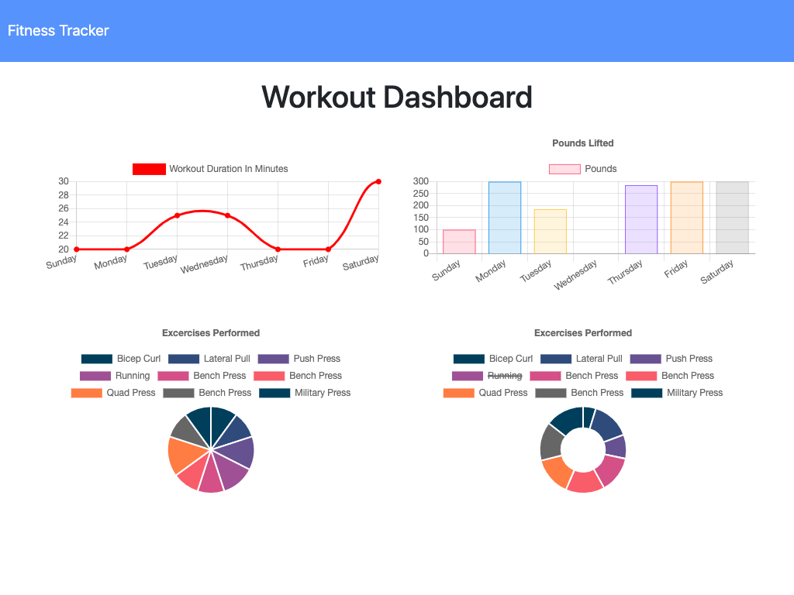
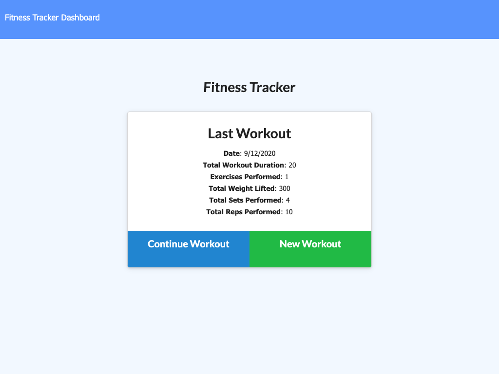
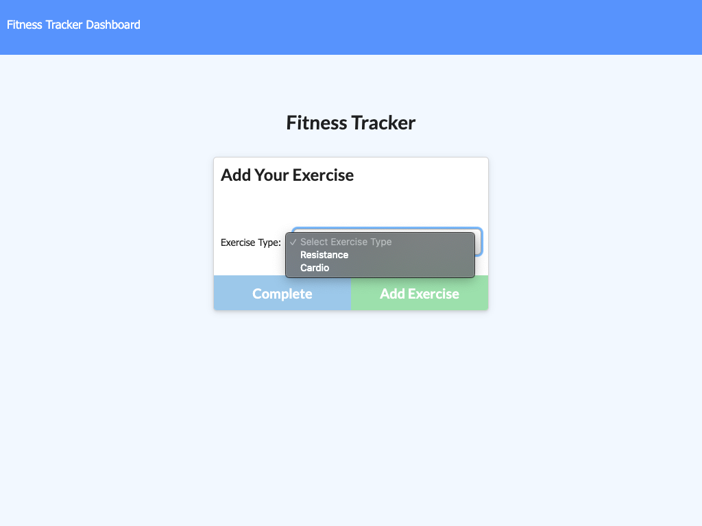

# [Workout Tracker](https://workout-tracker-1507.herokuapp.com/)

[](https://www.codacy.com/manual/thadkingcole/workout_tracker?utm_source=github.com&utm_medium=referral&utm_content=thadkingcole/workout_tracker&utm_campaign=Badge_Grade)

[](LICENSE)
[](code_of_conduct.md)

An app to [track workouts](https://workout-tracker-1507.herokuapp.com/) using MongoDB

[](https://workout-tracker-1507.herokuapp.com/)

## Table of Contents

- [Installation](#installation)
- [Usage](#usage)
- [Contributing](#contributing)
- [Questions](#questions)
- [Credits](#credits)
- [License](#license)

## Installation

If you want to set up your own instances of this app, please follow the following steps:

1. Clone this repository using either **ssh**...

   ```git
   git clone git@github.com:thadkingcole/workout_tracker.git
   ```

   ... or clone using **https**...

   ```git
   git clone https://github.com/thadkingcole/workout_tracker.git
   ```

1. Install the required node modules.

    ```terminal
    cd workout_tracker
    npm i
    ```

1. Start the server with either one of the following commands.

    - ```npm start```
    - ```npm run watch```

1. Your app instance should be running on port 1507. If it is not, then you may be missing required software outside of node such as MongoDB. Make sure you have a MongoDB running locally.

[back to Table of Contents](#table-of-contents)

## Usage

To use the app, navigate to <https://workout-tracker-1507.herokuapp.com/>. You will see a screen that looks something like this:



This screen is the homepage. The last workout is shown with a blue ```Continue Workout``` button that allows more exercises to be added to the workout. Clicking this button will bring you to the exercise entry form.

If there is not a current workout, or it is desired to start a new workout, then click the green ```New Workout``` button. This will also take you to the exercise entry form, but will create a new workout in the database to which any entered exercises will be added.

Once on the exercise entry form, you should see something like this:



First, select which type of exercise you want to add to the workout. You can select between a **Resistance** (i.e. weight training) or **cardio** workout. Depending on which type you select will determine which form fields are available to be filled in.

Once all data has been entered, click either the green ```Add Exercise``` to add the entered exercise to the workout and return to the form to enter another exercise, or click the blue ```Complete``` button to add the entered exercise to the workout and return to the homepage.

From any page, click the ```Dashboard``` link in the top-left of the page to see the stats page, which will look something like this:


This allows you to keep track of your workout trends and chart your progress towards meeting your fitness goals!

[back to Table of Contents](#table-of-contents)

## Contributing

Your contribution is most welcome! Please refer to the contributing guidelines when making contributions to this project.

Please note that this project is released with a [Contributor Code of Conduct](code_of_conduct.md). By Participating in this project, you agree to abide by its terms.

[back to Table of Contents](#table-of-contents)

## Questions

Please direct any and all questions to [thadkingcole](https://github.com/thadkingcole) or via email at [thadjcole@gmail.com](mailto:thadjcole@gmail.com).

[back to Table of Contents](#table-of-contents)

## Credits

I would like to thank the following people/projects/resources:

- [mongoose](https://mongoosejs.com/) for MongoDB object modeling in node.
- [chart.js](https://www.chartjs.org/) for simple charts on stats page.

[back to Table of Contents](#table-of-contents)

## License

[MIT](LICENSE) copyright (c) 2020 [Thaddeus Cole](mailto:thadjcole@gmail.com).

[back to Table of Contents](#table-of-contents)
